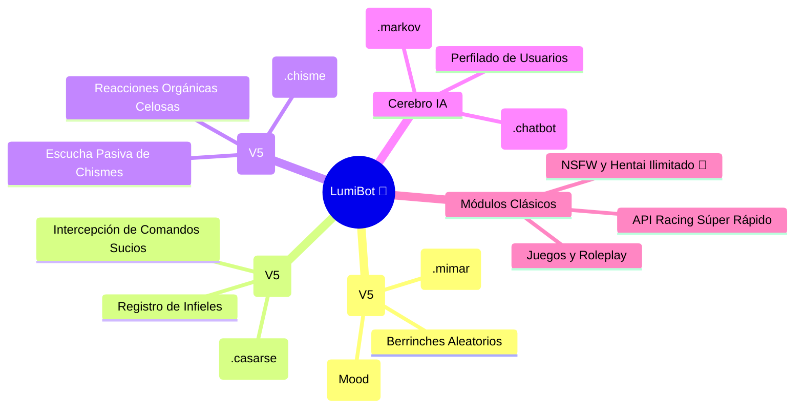
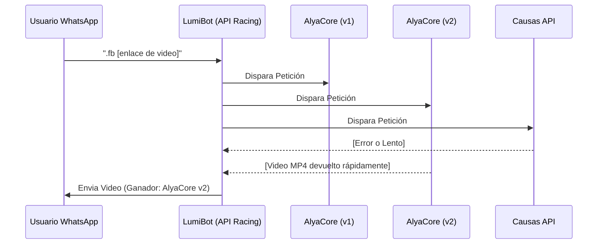
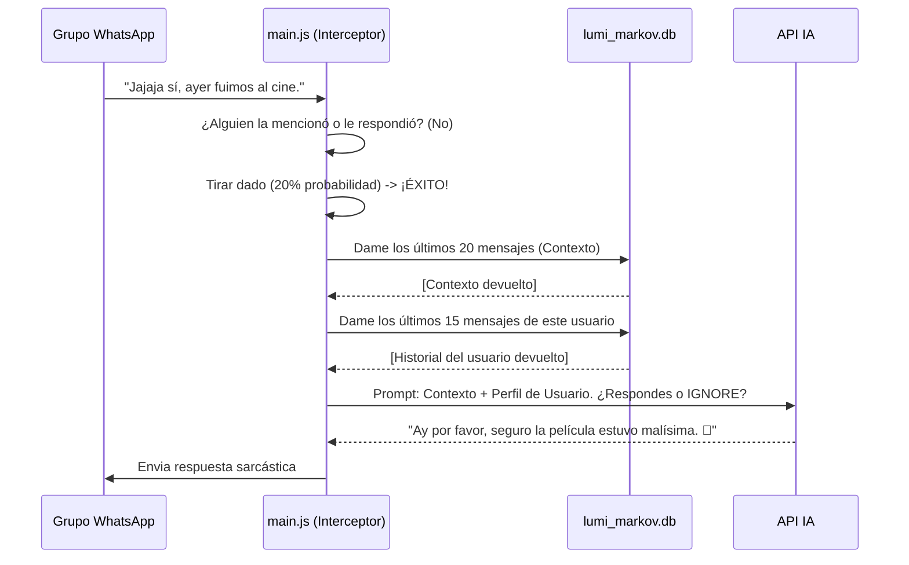
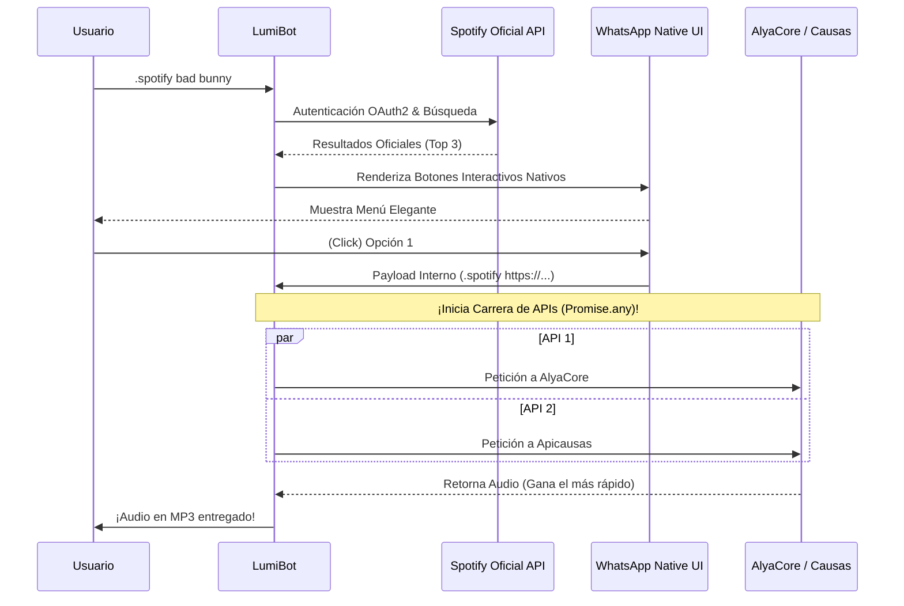
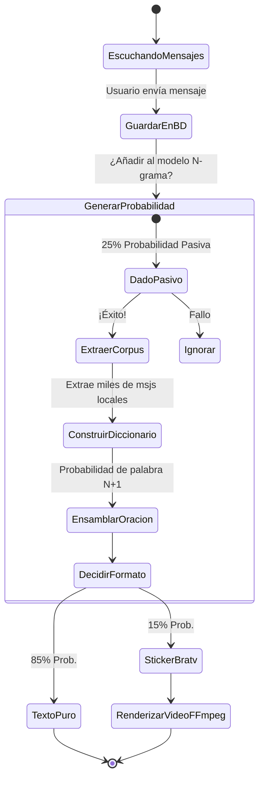
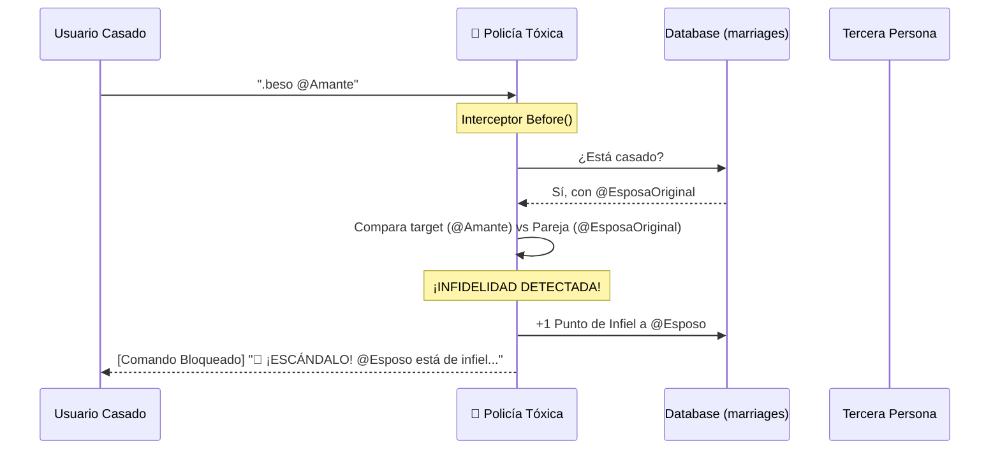

<div align="center">

# 💅✨ LUMI BOT v5.0.0 - DIVA ENGINE UPDATE ✨💅
**Tu Mejor Amiga, Diva Sarcástica, y la Policía Tóxica de WhatsApp**

   

[](https://github.com/LuferOS/LumiBot/stargazers)
[](https://github.com/LuferOS/LumiBot/releases)

<p><i>La bot definitiva que no solo administra tu grupo, sino que juzga tu ropa, se roba tus secretos, hace berrinches si no le regalas cosas, y expone las infidelidades públicamente.</i></p>

---

</div>

## 📖 Índice de Contenidos
1. [💅 ¿Quién es LumiBot?](#-quién-es-lumibot)
2. [🧠 Arquitectura e Inteligencia Artificial](#-arquitectura-e-inteligencia-artificial)
3. [🎮 Zonas de Entretenimiento y Juegos](#-zonas-de-entretenimiento-y-juegos)
4. [🔞 Módulo NSFW & Rol Explícito](#-módulo-nsfw--rol-explícito)
5. [🛠️ Lista Completa de Comandos](#️-lista-completa-de-comandos)
6. [⚙️ Guía de Instalación Avanzada](#️-guía-de-instalación-avanzada)
7. [💾 Estructura de la Base de Datos](#-estructura-de-la-base-de-datos)

---

## 💅 ¿Quién es LumiBot?
LumiBot ha evolucionado. Adiós a las terminales aburridas y los bots militares sin alma. Lumi es una **Inteligencia Artificial con personalidad propia**. Es sarcástica, adolescente/adulta, amante de los memes y **extremadamente celosa**. 

Además de hacer todo lo que un bot normal hace (descargar música, administrar grupos, crear stickers), ella **lee activamente los mensajes de tu grupo** para opinar, tirar hate o sumarse al chisme, siempre evaluando la personalidad de quién le habla basándose en el historial de mensajes de esa persona.

### 🗺️ Mapa Mental del Ecosistema Lumi


---

## 🏎️ Integración AlyaCore y API Racing

En su versión 4.0.0, LumiBot abandona las APIs estáticas e implementa un motor avanzado llamado **API Racing**. Ahora, cuando le pides un video a LumiBot (.fb, .ig, .spotify), múltiples servidores (incluyendo AlyaCore y Causas) compiten de forma asíncrona. ¡La primera API en responder es la que se te envía a tu WhatsApp!
Esto garantiza una tasa de éxito casi perfecta y descargas ultrarrápidas.



Además, incluye **más de 15 módulos nuevos**:
- **Inteligencia y Herramientas:** `.ocr`, `.upscale`, `.gpteditor`, `.whatmusic`, `.vocalremover`, `.translate`, `.emojimix`.
- **Interacciones Roleplay:** `.hug`, `.kiss`, `.slap`, etc (Impulsado por Waifu.pics).
- **Auto-Join Silencioso:** Lumi y todos los Subbots que crees se unen automáticamente a tu canal y grupo oficial.

---

## 🧠 Arquitectura e Inteligencia Artificial

Lumi cuenta con dos cerebros diferentes que operan en paralelo para garantizar la mejor experiencia en WhatsApp sin agotar los límites de las APIs externas.

### 1. IA Interceptora Activa (`.chatbot on/off`)
Cuando activas este módulo, Lumi deja de ser pasiva y comienza a escuchar activamente la conversación.

* **Memoria Fotográfica (Perfilado de Usuarios):** Cada vez que hablas, Lumi extrae tus últimos **15 mensajes exactos** de la base de datos local (`lumi_markov.db`). Cuando decides interactuar con ella, usa esa información para saber qué tipo de persona eres y tratarte en base a ello. Si eres molesto, te tratará mal; si eres simpático, será una diva contigo.
* **Lectura de Contexto:** Antes de responder, lee los últimos 20 mensajes globales de la conversación para entender de qué hablan.
* **Filtro de Aburrimiento ("IGNORE"):** Si el tema no le interesa, la IA devuelve `IGNORE` internamente y Lumi simplemente ignora el mensaje para no ser pesada ni saturar la API de AlyaCore.
* **Gatillo Inteligente:** Tiene un 100% de probabilidad de responder si mencionan su nombre ("Lumi") o le responden un mensaje directamente. Si nadie le habla, tiene un **20% pasivo de meterse en charlas ajenas** de forma sarcástica.

#### Diagrama de Intercepción Activa


### 2. Cerebro Markoviano (`.markov on/off`)
Además del modelo de lenguaje en la nube, Lumi tiene un cerebro pasivo entrenado exclusivamente por ti y tus amigos usando **Cadenas de Markov (N-gramas)**.
- Aprende estadísticamente qué palabra suele seguir a otra en tu grupo.
- Imita modismos, groserías o frases internas de tu círculo social.
- Al activarlo, puede escupir oraciones sin sentido lógico pero gramaticalmente correctas para tu grupo. 
- ¡Puede generar **Stickers Animados (.bratv)** a partir de sus pensamientos matemáticos!

### 3. Arquitectura de Descargas Inteligentes (API Racing)
LumiBot no confía en un solo proveedor. Para garantizar descargas ultrarrápidas y evitar caídas, implementa un sistema avanzado de **Carrera de APIs (`Promise.any`)** conectado simultáneamente a **AlyaCore** y **Apicausas**.

En comandos complejos como Spotify y TikTok, el flujo incluye interactividad nativa:

#### Diagrama de Spotify (Búsqueda Nativa + Descarga por Carrera)

#### Flujo de Aprendizaje y Ejecución de Markov


## 💅 El Motor de Diva y la Policía Tóxica (Novedad v5.0)

En esta nueva versión, LumiBot ya no es solo una IA que responde. Ahora tiene **emociones, hace berrinches, crea relaciones y destruye hogares**.

### 1. Sistema de Ánimo Dinámico (Mood Engine)
Cada vez que un usuario pide un comando, Lumi pierde paciencia. Si llega a un nivel bajo de ánimo (Berrinche), tiene una gran probabilidad de **negarse a ejecutar el comando** soltando quejas. Para arreglarlo, los usuarios deben comprarle regalos virtuales con `.mimar`.

### 2. La Policía Tóxica (Detector de Cuernos)
Lumi intercepta todos los comandos interactivos. Así funciona:



### 3. La Red de Chismes Global
Lumi escucha todos los mensajes en busca de palabras clave (`infiel`, `terminamos`, `pack`, etc.). Si encuentra un mensaje "jugoso", lo guarda anónimamente en SQLite. Cualquiera puede usar el comando `.chisme` para que Lumi exponga un secreto aleatorio robado de otro chat.

---

---

## 🎮 Zonas de Entretenimiento y Juegos

El módulo de juegos ha sido programado de forma dinámica. En lugar de usar arrays estáticos aburridos, Lumi usa **generadores de plantillas dinámicas** (Template Builders).

* **`.casarse` / `.divorcio`**: Crea un lazo oficial en la base de datos con otra persona.
* **`.mimar`**: Envíale regalos virtuales a Lumi para subir su barra de paciencia/ánimo.
* **`.infieles`**: El muro de la vergüenza, descubre quiénes son los peores rompehogares del grupo.
* **`.funar`**: Destruye la moral de alguien con más de 2000 combinaciones aleatorias de insultos, chismes y situaciones vergonzosas.
* **`.chisme`**: Extrae un secreto jugoso, previamente robado por Lumi de alguna otra charla (totalmente anónimo).
* **`.ruina`**, **`.8ball`**, **`.ship`**: Toda la diversión clásica para emparejar y humillar públicamente a tus amigos.

---

## 🔞 Módulo NSFW & Rol Explícito

Lumi cuenta con un inmenso catálogo de interacción social ("Roleplay") impulsado por la API de interacción para reaccionar con GIFs de anime. Este catálogo se divide en dos:

### SFW (Apto para todo público)
Acciones adorables o violentas como: `.hug`, `.kiss`, `.slap`, `.punch`, `.cry`, `.pat`, `.dance`, `.bite`, `.cuddle`, `.blush`, `.angry`, y docenas más.

### NSFW (Bajo tu propio riesgo) 😈
Para los grupos de moral dudosa, Lumi tiene comandos explícitos:
- Descarga de videos: `.xnxx`, `.xvideos`, `.pornhub`
- Roleplay subido de tono: `.spank`, `.undress`, `.yuri`, `.sixnine`, `.anal`, `.fuck`, `.cumshot`, `.pegging`, `.deepthroat`, `.orgy`, y muchos más.

---

## 🛠️ Lista Completa de Comandos

Lumi cuenta con más de 100 comandos divididos en categorías. Puedes consultar el menú en tiempo real con `.menu`.

### 💅 Utilidades (Porque soy útil)
| Comando | Descripción |
| :--- | :--- |
| `.letra` | Convierte texto a letras aesthetic |
| `.dox` | "Doxea" a alguien con datos falsos graciosos |
| `.simp` | Mide tu nivel de simp por alguien |
| `.clima` | Para saber si lloverá en tu ciudad |
| `.enhance` | Arregla la resolución de fotos borrosas (IA) |
| `.read` | Lee a la fuerza mensajes "ViewOnce" (Ver una vez) 👀 |
| `.tape` | Envía un mensaje anónimo secreto a un canal |
| `.meme` | Genera un meme dinámico usando IA 🤣 |
| `.lyrics` | Saca la letra de tu canción favorita 🎶 |
| `.wikipedia` | Busca resúmenes y datos de Wikipedia 📚 |
| `.audio` | Accede al menú de más de 70 audiomemes |

### 📥 Descargas (Robando contenido)
| Comando | Descripción |
| :--- | :--- |
| `.spotify` | Descarga la pista musical original desde Spotify 🎧 |
| `.soundcloud` | Busca y descarga canciones desde SoundCloud 🎵 |
| `.igstalk` | Stalkea en secreto a perfiles de Instagram 📸 |
| `.tiktokstalk` | Saca toda la data de alguien en TikTok 🎵 |

### 🧠 Inteligencia Artificial
| Comando | Descripción |
| :--- | :--- |
| `.chatbot on/off` | Activa la diva que lee todo y responde automáticamente |
| `.markov on/off` | Activa el loro estadístico matemático |
| `.chatgpt` | Pregunta directa a ChatGPT |
| `.gemini` | Pregunta directa a Gemini |
| `.copilot` | Pregunta directa a Copilot |
| `.dalle` | Genera imágenes locas con IA |

### 🎨 Stickers y Edición a mi Estilo
| Comando | Descripción |
| :--- | :--- |
| `.qs [1-5]` | Crea un sticker hermoso citando los últimos 1 a 5 mensajes de la charla |
| `.brat` | Genera un sticker estilo álbum Brat (fondo verde chillón) |
| `.bratv` | Lo mismo, pero en un sticker animado (video) |
| `.sticker` | Convierte cualquier imagen/video corto en sticker |

### 👑 Administración y Moderación
| Comando | Descripción |
| :--- | :--- |
| `.fantasmas` | Escanea la base de datos y etiqueta a los que no hablan |
| `.top` | Muestra el ranking de las personas más charlatanas |
| `.kick` | Elimina a un usuario del grupo |
| `.promote` / `.demote` | Sube o baja de rango a un integrante |

---

## ⚙️ Guía de Instalación Avanzada

LumiBot está diseñado para correr en servidores VPS (Ubuntu/Debian), Pterodactyl (Node.js), o Windows localmente.

### Prerrequisitos
- Node.js v21 o superior.
- Git instalado.
- FFmpeg instalado en el sistema (requerido para crear y convertir stickers animados).

### Instalación Paso a Paso (Windows/Linux)

1. **Clonar el Repositorio**
   ```bash
   git clone https://github.com/LuferOS/LumiBot.git
   cd LumiBot
   ```

2. **Instalar Dependencias**
   ```bash
   npm install
   ```

3. **Ejecutar a la Reina**
   ```bash
   npm start
   ```

4. **Vincular WhatsApp**
   - Al iniciar, la consola mostrará un código QR.
   - Abre WhatsApp en tu teléfono -> Dispositivos Vinculados -> Vincular Dispositivo.
   - Escanea el código QR de la consola.
   - ¡Listo! LumiBot ya estará operando.

5. **Panel Web**
   - Abre tu navegador y dirígete a `http://localhost:3000` para ver las estadísticas en vivo.

---

## 💾 Estructura de la Base de Datos

LumiBot usa dos mecanismos de memoria distintos:

1. **La Base de Datos Principal (`database.json` -> SQL `database.sqlite`)**
   Ahora todo opera en un archivo de base de datos SQLite multi-thread ultra veloz, gracias al motor WAL. Esto reemplaza el lento LowDB para las operaciones de Top Mensajes y los registros.

2. **La Red Neuronal Pasiva (`lumi_markov.db`)**
   Usada exclusivamente para Cadenas de Markov y el análisis de perfilamiento de IA.

3. **La Base de Datos de Diva (`bot_state` / `gossip` / `marriages`)**
   Alojada en el mismo archivo SQLite de núcleo, guarda las relaciones de la comunidad, el ánimo del bot y la colección de chismes obtenidos de forma pasiva.

> [!WARNING]
> **Privacidad:** El archivo `.gitignore` está configurado para **NUNCA** subir `database.json`, `lumi_markov.db` ni la carpeta `Sessions/` a GitHub. Si remueves esto, expondrás las conversaciones de todos tus grupos al internet público. 

---

<div align="center">
<p><b>Developed by LuferOS 💅 Merezco mínimo una estrella en el repositorio, bebé.</b></p>
</div>
